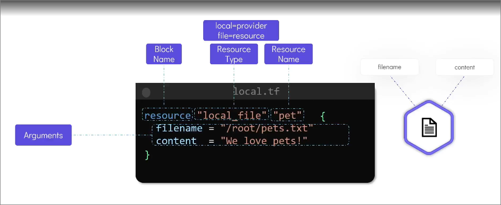
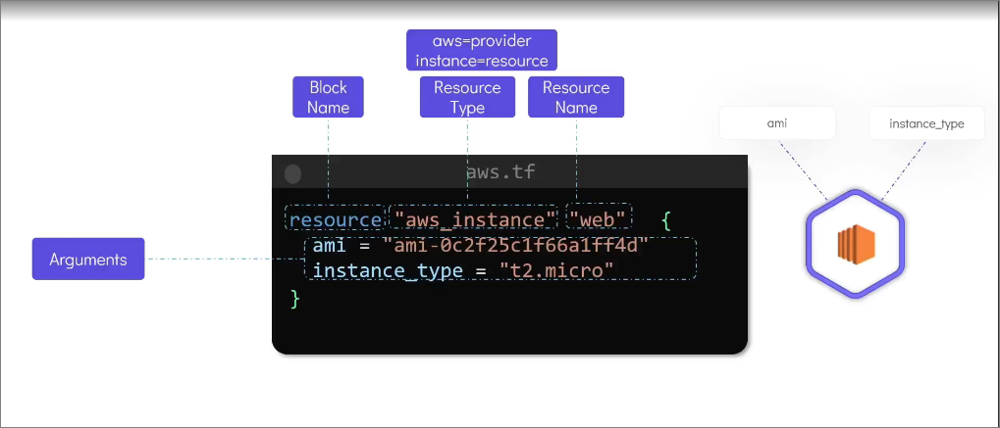

# 🚀 𝐌𝐚𝐬𝐭𝐞𝐫 𝐓𝐞𝐫𝐫𝐚𝐟𝐨𝐫𝐦 𝐢𝐧 𝟏𝟒 𝐃𝐚𝐲𝐬! 🚀

## Objectives

- Iac Concepts
- Terraform Providers
- Variables, Resource Attributes, & Dependencies
- Terraform State Management
- Read, Generate & Modify Configuration Files
- Terraform CLI
- Terraform Modules
- Terraform Cloud

## Understanding Infrastructure as Code (IaC)

### Types of IAC Tools

1. Configuration Management Tools (e.g., Ansible, Puppet, SaltStack)

- Most commonly used to install and manage software on existing infrastructure resources such as servers, databases, and networks.
- Maintains standard structure
- Version control
- Idempotent (run code multiple times without changing the result beyond the initial application)
- Uses the procedural language approach (you define the steps to achieve the desired state, and the tool executes those steps in order)

```yml
# Example of Ansible Playbook

- name: Install and start Apache
  hosts: webservers
  tasks:
    - name: Install Apache
      apt:
        name: apache2
        state: present
    - name: Start Apache
      service:
        name: apache2
        state: started
```

2. Server Templating Tools (e.g., Docker, Packer, Vagrant)

- Used to create and manage customserver images or templates that can be deployed across different environments.
- Pre installed software and dependencies.
- Virtual machines, containers, or cloud instances.
- Immutable infrastructure (once created, they cannot be modified, and any changes require creating a new image or template)

3. Provisioning/Orchestration Tools (e.g., Terraform, CloudFormation, Pulumi)

- Used to provision and manage infrastructure resources across various cloud providers and on-premises environments.
- Infrastructure as Code (IaC) tools that allow you to define and manage infrastructure resources using code.
- Declarative syntax (you describe the desired state of your infrastructure, and the tool takes care of the rest)
- Idempotent (run code multiple times without changing the result beyond the initial application)
- The `**terraform.tfstate**` file is used to store the state of the infrastructure resources managed by Terraform. It contains information about the current state of the resources, including their attributes and dependencies. This file is crucial for Terraform to track changes and manage the lifecycle of the infrastructure effectively.

```hcl
# Example of Terraform Configuration File

provider "aws" {
  region = "us-west-2"
}
resource "aws_instance" "example" {
  ami           = "ami-0c55b159cbfafe1f0"
  instance_type = "t2.micro"

  tags = {
    Name = "ExampleInstance"
  }
}
```
**Sample Terraform Local File Structure 1:**




**Sample Terraform AWS ProviderFile Structure 2:**



### Code Workflow

Write: Create and edit Terraform configuration files using HCL (HashiCorp Configuration Language).

1. Initialize: Run `terraform init` to initialize the working directory and download the necessary provider plugins.
2. Plan: Run `terraform plan` to see the execution plan and understand what changes will be made to the infrastructure.
3. Apply: Run `terraform apply` to execute the changes and provision the infrastructure resources as defined in the configuration files.
4. Destroy: Run `terraform destroy` to tear down the infrastructure resources that were provisioned by Terraform.

### Terraform File Names

| File Name           | Purpose                                                                 |
|---------------------|-------------------------------------------------------------------------|
| `main.tf`           | Contains the primary configuration for resources and providers.          |
| `variables.tf`      | Defines input variables that can be used to parameterize the configuration. |
| `outputs.tf`        | Defines output values that can be used to display information after applying the configuration. |
| `terraform.tfvars`  | Contains variable values that can be used to override default values defined in `variables.tf`. |
| `providers.tf`      | Contains provider configurations, specifying the cloud providers or services to be used. |
| `backend.tf`        | Contains backend configuration for remote state management, specifying where the Terraform state file should be stored. |
| `versions.tf`       | Contains version constraints for Terraform and provider plugins to ensure compatibility. |


## Resource Links:

1. Introduction to Terraform https://lnkd.in/guZkiFBP
2. Basics of Terraform https://lnkd.in/gppbq8ed
3. Variables and Outputs https://lnkd.in/gJXb2u3D
4. Terraform State Management https://lnkd.in/gDepmUdD
5. Terraform Module https://lnkd.in/gSZMZ-7F
6. Provisioners and Meta-Arguments https://lnkd.in/g5zFxTb3
7. Mini Project https://lnkd.in/gtET_p5v
8. Terraform Cloud and Workspaces https://lnkd.in/gdBdB_vP
9. Terraform with CI/CD https://lnkd.in/giZgf8QF
10. Handling Secrets and Security in Terraform https://lnkd.in/gywgK-h3
11. Debugging and Troubleshooting Terraform https://lnkd.in/gWX-3QTw
12. Terraform Best Practices https://lnkd.in/g7iDVnfP
13. Terraform With Kubernetes https://lnkd.in/gEziumJK
14. Terraform Enterprise, Sentinel, Custom Providers https://lnkd.in/g_FNYS9c